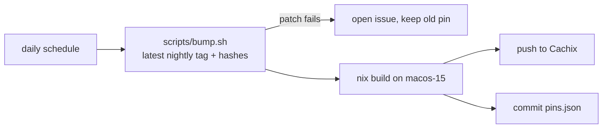

# t3code-patched

[T3 Code](https://github.com/pingdotgg/t3code) nightly, built with Nix from the
nixpkgs `t3code` derivation, plus the patches in `patches/`.



## Patches

- `cache-badge.patch` - context meter shows prompt-cache hit share and
  "warm until HH:MM" (60-minute Claude subscription TTL), plus a status dot.

## Use

```nix
inputs.t3code-patched.url = "github:connorads/t3code-patched";
# no `inputs.nixpkgs.follows` - it would miss the binary cache
environment.systemPackages = [ inputs.t3code-patched.packages.aarch64-darwin.default ];
```

Cachix is enabled when the repo variable `CACHIX_CACHE` and secret
`CACHIX_AUTH_TOKEN` are set.
